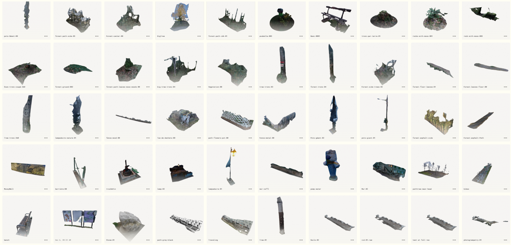
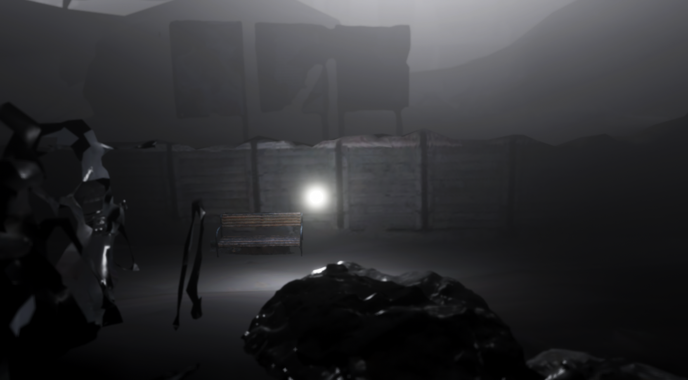

## What I want to do
 - I want to make a Game/Interactive Experience (2.5D plateformer)
 - Night Animals/Insects are attracted to light(Moon). 
 - Animals/Insects/Human relationship to light as a main inspiration of gameplay 

 ## Basically
 - You play an unknown source of light which as the power to light up things

## How I imagine the experience 
- Should have 4 finished "levels" such as "puzzles": Intro, Forest, Village, City.
- Huge inspiration from "Limbo" and "Inside".

## Levels Ideas:

- Level 1: Forest : turn ON mecanical sunflowers to light up a big battery.
- Level 2: Village : A danger is absorbing every light it touches, hide in the shadows to not die.
- Level 3: City : Escape the insects that want to gets you by turning on every light you see.
- Level 4: City : Turn on every green light on the right sequence.

## Atmosphere
- Photogrammetry scanning: Lights Sources, environnements, elements
- Dark, Nearly GreyScaled, Fog.

## Sound
- Ambiance should be noisy and glitchy. Creating my own "dark" soundtrack using Ableton.
- Sound design: Using my mouth and some post adjustment to make sounds elements.

## What I got so far

  

  

  

