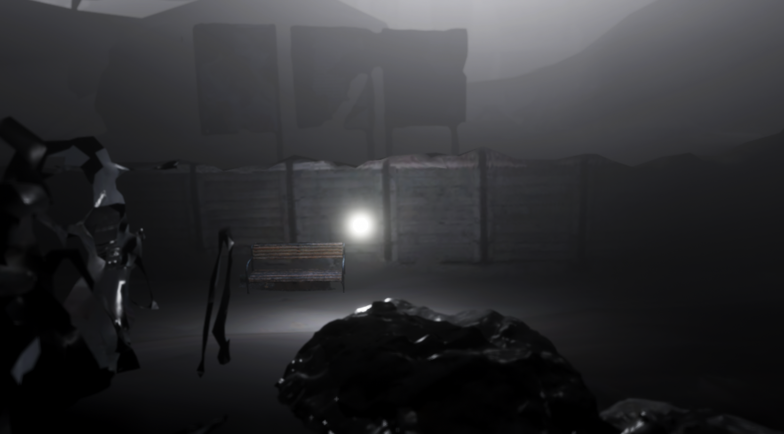

## Test Day

# What I want to do
 - I want to make a Game/Interactive Experience (2.5D plateformer)
 - Night Animals/Insects are attracted to light(Moon). 
 - But they can't join the moon because there are too many artificial lights 

 ## Basically
 - You play the "moon" trying to escape the devils insects by turning ON every artificial lights you see.

## How do I prototype with Unity?
- Photogrammetry scanning: Lights Sources, environnements, elements
- Trying to find the right atmosphere I want to show: Changing scans, how do I use lights ?

## Goal for TestDay
- Proposing 3 different visual direction where the player can move around. 

## What I got so far

## Test day Feedbacks !!!

Observation on using inputs:

Most people don't know they can use the mouse. (They click once, nothing happend, so they assume it's not used).
They try to use the arrows keys first and the switch to asdw. 
Don't know they can use space easily.

References Mentionned: Unravel, Limbo.
Gameplay: How to introduce mecanics, going up ? like a jet pack.
Player is most of the time on the ground but can go up like a jet pack with stamina?
Can introduce platforms.
The player is a light, should it be another thing ? to humanize: like a floating device ? 

Don't forget to think about gameplay loops:
- 1 is to escape from the swarm by turning light up
- How do the swarm appears

Mecanics:
Is the dash necessary ?
StreetLights take times to lights UP ?

